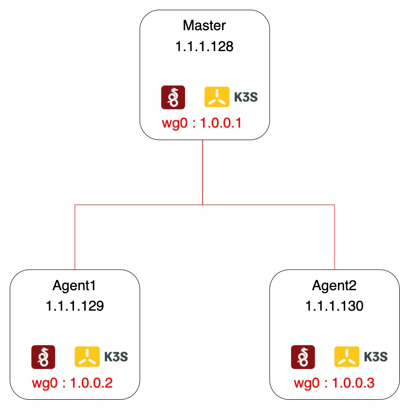

# Project Documentation: 
# K3s Cluster with Wireguard VPN
## Overview
This project involves the creation of a cluster of nodes using K3s, a lightweight Kubernetes distribution, with Wireguard employed as the VPN solution to connect these nodes securely. The goal of my work was setup a cluster of `edge devices` and ensuring the connection of them with a VPN connection. The repository includes two main folders, namely `k3s` and `Wireguard`, housing Ansible scripts for automating the setup of the cluster.
## Cluster sample

Following this setup you will have:
- A cluster with comunication between nodes by secure vpn channel.
- Controll plane, even with more master nodes, avaliable at the virtual IP address specified in `apiserver_endpoint` in `k3s/inventory/my-cluster1/group_vars/all.yml`.
- MetalLB to specify which range of ip address should be assigned to your services. Check `metal_lb_ip_range` in `k3s/inventory/my-cluster1/group_vars/all.yml`.
## Table of Contents
- [Project Documentation:](#project-documentation)
- [K3s Cluster with Wireguard VPN](#k3s-cluster-with-wireguard-vpn)
  - [Overview](#overview)
  - [Cluster sample](#cluster-sample)
  - [Table of Contents](#table-of-contents)
  - [Prerequisites](#prerequisites)
  - [Folder Structure](#folder-structure)
  - [Step 1: Wireguard VPN](#step-1-wireguard-vpn)
  - [Step 2: K3S Setup](#step-2-k3s-setup)
  - [Usage](#usage)
  - [Script Credits](#script-credits)
    - [Original Sources](#original-sources)
    - [Blog and others references](#blog-and-others-references)
  - [Contributing](#contributing)

## Prerequisites

Before proceeding with the setup, ensure the following prerequisites are met:
Ansible:
```
pip install ansible
```

## Folder Structure
For a correct understanding, read the comments and documentation within the files themselves.
- **k3s/**
  - [ansible.cfg](k3s/ansible.cfg)
  - [collections](k3s/collections/)
  - [example](k3s/example/)
  - [inventory](k3s/inventory/)
  - [molecule](k3s/molecule/)
  - [reboot.yml](k3s/reboot.yml)
  - [requirements.txt](k3s/requirements.txt)
  - [reset.yml](k3s/reset.yml)
  - [roles](k3s/roles/)
  - [site.yml](k3s/site.yml)
  - [template](k3s/templates/)

- **wireguard/**
  - [group_vars](wireguard/group_vars/)
  - [script](wireguard/script/)
  Folder and script to add peer at the server after their startup. Basically, for each client after its wireguard initializazion Ansible will take their respective public keys and store it on the server. Once did this, with the script we will add the peers using the information stored in `tmp` forder. The information about the peer has the follow structure:
  File Name = Client ip in the wireguard network
  File Content = Wireguard Public Key
  - [inventory.ini](wireguard/inventory.ini) 
  - [playbook.yml](wireguard/playbook.yml)

- **manual setup/**
Script to deploy the cluster without some features provided from the automated one. For instance MetalLB and VIP. This was the first attemps to make this project. 
 - [setupAgent](manualSetup/setupAgent)
 - [setupMaster](manulSetup/setupMaster/)

## Step 1: Wireguard VPN
[Wireguard setup](wireguard/README.md)
## Step 2: K3S Setup
[K3S setup](k3s/README.md)

## Usage
To check if everything is working:
```
kubectl get nodes -o wide
```
To deploy a simple `nginx` container and check its status:
```
kubectl apply -f example/deployment.yml

kubectl get deployments
``` 
To deploy a sample service for expose your deployment and check it:
```
kubectl apply -f example/service.yml

kubectl get service
```
To try a simple request:
```
curl <ip specified in the range in conf file>
```


## Script Credits
The scripts utilized in this project have been adapted and customized based on existing scripts to meet the specific requirements of the cluster setup. While the core functionalities may have originated from external sources, modifications and adaptations have been made to suit the needs of this project.

### Original Sources 
- https://github.com/Tangram-Vision/Tangram-Vision-Blog/tree/main/2021.03.04_AnsibleVpnSetup
- https://github.com/techno-tim/k3s-ansible
### Blog and others references
- https://technotim.live/posts/k3s-etcd-ansible/
- https://www.tangramvision.com/blog/exploring-ansible-via-setting-up-a-wireguard-vpn
- https://www.inovex.de/de/blog/how-to-set-up-a-k3s-cluster-on-wireguard/
- https://www.wireguard.com/quickstart/
- https://docs.k3s.io
## Contributing
Feel free to modify and improve everything, just let me know :)

